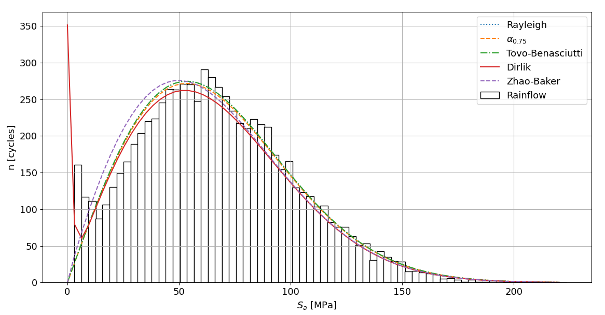

# Fatiguepy Package

## Available Methods
This package can estimate fatigue life by 6 methods in frequency domain and a method in time domain:

* Rainflow

* Narrow Band
* Rice
* Wirsching-Light
* Tovo-Benasciutti
* 
* Dirlik
* Zhao-Baker

The package requires numpy, math and fatpack

## Instalation

Install directly the package by pip:

```
pip install fatiguepy
```

## Obtaining Power Spectral Density

First, it is necessary to do the calculations of the probability moments.
So, you need Power Spectral Density. To test this package, a random history filtered will be used to get PSD, as seen below

```python
import numpy as np
from scipy import signal

xf = 10
fs = 1024
dt = 1/fs

x = np.arange(0, xf, dt)

signal1 = np.random.randn(len(x))

nyquist = ((len(x)/max(x))/2)

left_pass  = 1.1*50/nyquist
left_stop  = 0.9*50/nyquist
right_pass = 0.9*120/nyquist
right_stop = 1.1*120/nyquist

(N, Wn) = signal.buttord(wp=[left_pass, right_pass],
            ws=[left_stop, right_stop],
            gpass=2, gstop=30, analog=0)

(b, a) = signal.butter(N, Wn, btype='band', analog=0, output='ba')

y = signal.filtfilt(b, a, signal1)

window = signal.hann(len(y), False)

f, Gyy = signal.welch(y, fs, return_onesided=True, window=window, average='median')
```

## Probability Moments

Once the PSD and frequency are obtained, just use the module present in the fatiguepy package. Function moment0 to moment4 returns respective probability moment, E0 returns the expected positive zero-crossing rate, EP returns the expected peak occurrency frequency and alpha2 returns spectral width parameter.


### Parameters

 (*ndarray*):
Power Spectral Density or Power Spectrum of Stress History y

 (*ndarray*):
array of sample frequencies


```python
from fatiguepy import *
moments = prob_moment.Probability_Moment(Gyy, f)

m0 = moments.momentn(0)
m1 = moments.momentn(1)
m2 = moments.momentn(2)
m4 = moments.momentn(4)
m75 = moments.momentn(0.75)
m15 = moments.momentn(1.5)

E0 = moments.E0()
EP = moments.EP()
gamma = moments.alphan(2)
```

Steel SAE 1015 was considered, so Python can perform the calculations.

```python
b = -0.138
sigmaf = 1020
A = (2**b)*sigmaf
k = -1/b
C = A ** k
```

## Damage

The damage intensity (Damage/unit of time) calculated by every method is given by the following equation:

<p align=center>

</p>

Where  is PDF of amplitude, k and C is material property,  is equivalent to expected number of peaks and s is stress.

## Narrow Band (NB)

For narrow band processes it is reasonable to assume that every peak coincides with a cycle and that, consequently, the amplitudes of the cycles are distributed according to a Rayleigh function.

PDF returns the Probability Density Function of Narrow-Band Method, counting_cycles convert PDF in n [cycles] and loading_spectrum returns the number of cycles having amplitude higher or equal to s.

### Parameters

 (*float*):
Slope of SN Curve

 (*float*):
Constant of SN Curve

 (*ndarray*):
Power Spectral Density or Power Spectrum of Stress History y

 (*ndarray*):
Array of sample frequencies

 (*ndarray*):
Array of sample stresses


```python
si = 0.0
sf = abs(max(y)-min(y))
ds = sf/128
s = np.arange(si, sf, ds)

NB = Narrow_Band.NB(k, C, Gyy, f, xf, s)
pNB = NB.PDF()

DNB = NB.Damage()
TNB = NB.Life()
TNBs = NB.Lifes()
```

Damage returns the Damage by NB approach, Life returns the period until failure (in cycles) and Lifeh returns the life in hours.

For the history in study, this method return the respective results:

```
DNB = 0.001030912564660966 per second
TNB = 9.70014368123321 cycles
TNBs = 970.014368123321 seconds
```

## Rice (RC)

Rice model is a mix of Rayleigh and a gaussian distribution.

PDF returns the Probability Density Function of Narrow-Band Method, counting_cycles convert PDF in n [cycles] and loading_spectrum returns the number of cycles having amplitude higher or equal to s.

### Parameters

 (*float*):
Slope of SN Curve

 (*float*):
Constant of SN Curve

 (*ndarray*):
Power Spectral Density or Power Spectrum of Stress History y

 (*ndarray*):
Array of sample frequencies

 (*ndarray*):
Array of sample stresses


```python
si = 0.0
sf = abs(max(y)-min(y))
ds = sf/128
s = np.arange(si, sf, ds)

RC = Narrow_Band.RC(k, C, Gyy, f, xf, s)
pRC = RC.PDF()

DRC = RC.Damage()
TRC = RC.Life()
TRCs = RC.Lifes()
```

For the history in study, this method return the respective results:

```
DRC = 0.000970230261843453 per second
TRC = 10.306831680347546 cycles
TRCs = 1030.6831680347545 seconds
```

## Wirsching-Light (WL)

To this method, Wirsching and Light considered an width parameter to correct Narrow-Band approximation with an empirical factor. It can be done with the fatiguepy package as follows:

### Parameters

 (*float*):
Slope of SN Curve

 (*float*):
Constant of SN Curve

 (*ndarray*):
Power Spectral Density or Power Spectrum of Stress History y

 (*ndarray*):
Array of sample frequencies

 (*ndarray*):
Array of sample stresses


```python
si = 0.0
sf = abs(max(y)-min(y))
ds = sf/128
s = np.arange(si, sf, ds)

WL = Wirsching_Light.WL(k, C, Gyy, f, xf, s)
DWL = WL.Damage()
TWL = WL.Life()
TWLs = WL.Lifes()
```
For the history in study, this method return the respective results:
```
DWL = 0.00130530261843453 per second
TWL = 7.661058714486574 cycles
TWLs = 766.1058714486574 seconds
```

## Tovo-Benasciutti (TB)

To this method, Tovo and Benasciutti proposed an approach where the
fatigue life is calculated as a linear combination of the upper and lower fatigue-
damage intensity limits. It can be done with the fatiguepy package as follows:

### Parameters

 (*float*):
Slope of SN Curve

 (*float*):
Constant of SN Curve

 (*ndarray*):
Power Spectral Density or Power Spectrum of Stress History y

 (*ndarray*):
Array of sample frequencies

 (*ndarray*):
Array of sample stresses


```python
si = 0.0
sf = abs(max(y)-min(y))
ds = sf/128
s = np.arange(si, sf, ds)

TB = Tovo_Benasciutti.TB(k, C, Gyy, f, xf, s)
pTB = TB.PDF()

DTB = TB.Damage()
TTB = TB.Life()
TTBs = TB.Lifes()
```
For the history in study, this method return the respective results:
```
DTB = 0.0009706076291897186 per second
TTB = 10.302824436222686 cycles
TTBs = 1030.282443622268 seconds
```

##  method (AL)

This method is a correction method based in a spectral parameter , and it's can be done as follows:

### Parameters

 (*float*):
Slope of SN Curve

 (*float*):
Constant of SN Curve

 (*ndarray*):
Power Spectral Density or Power Spectrum of Stress History y

 (*ndarray*):
Array of sample frequencies

 (*float*):
Observation period

 (*ndarray*):
Array of sample stresses


```python
si = 0.0
sf = abs(max(y)-min(y))
ds = sf/128
s = np.arange(si, sf, ds)

AL = alpha075.AL(k, C, Gyy, f, xf, s)
pAL = AL.PDF()

DAL = AL.Damage()
TAL = AL.Life()
TALs = AL.Lifes()
```
For the history in study, this method return the respective results:
```
DAL = 0.0010114366327434396 per second
TAL = 9.886926848670504 cycles
TALs = 988.6926848670504 seconds
```

## Dirlik

This method has long been considered to be one of the best and has already been subject to modifications, e.g., for the inclusion of the temperature effect.

### Parameters

 (*float*):
Slope of SN Curve

 (*float*):
Constant of SN Curve

 (*ndarray*):
Power Spectral Density or Power Spectrum of Stress History y

 (*ndarray*):
Array of sample frequencies

 (*ndarray*):
Array of sample stresses


The functions for this method are analogous to the NB functions:

```python
si = 0.0
sf = abs(max(y)-min(y))
ds = sf/128
s = np.arange(si, sf, ds)

DK = Dirlik.DK(k, C, Gyy, f, xf, s)

ps = DK.PDF()

DDK = DK.Damage()
TDK = DK.Life()
TDKs = DK.Lifes()
```
For the history in study, this method return the respective results:
```
DDK = 0.000897359786515067 per second
TDK = 11.143802241055845 cycles
TDKs = 1114.3802241055845 seconds
```

## Zhao-Baker (ZB)

This method combined theoretical assumptions and simulation results to give the linear combination of Weibull and Rayleigh Probability Density Function.

### Parameters

 (*float*):
Slope of SN Curve

 (*float*):
Constant of SN Curve

 (*ndarray*):
Power Spectral Density or Power Spectrum of Stress History y

 (*ndarray*):
Array of sample frequencies

 (*ndarray*):
Array of sample stresses


The results can be obtained in the same way as the previous methods:

```python
si = 0.0
sf = abs(max(y)-min(y))
ds = sf/128
s = np.arange(si, sf, ds)

ZB = Zhao_Baker.ZB(k, C, Gyy, w, xf, s)
psZB = ZB.PDF()

DZB = ZB.Damage()
TZB = ZB.Life()
TZBs = ZB.Lifes()
```
For the history in study, this method return the respective results:
```
DZB = 0.0009079850858869257 per second
TZB = 11.013396756657006 cycles
TZBs = 1101.3396756657006 seconds
```

## Rainflow

If you want to calculate rainflow amplitude histogram, you can use the Rainflow module of this package.

### Parameters

 (*float*):
Constant of SN Curve

 (*float*):
Slope of SN Curve

 (*ndarray*):
Stress History y

 (*ndarray*):
time
 (*int*):
number of bins

The results can be obtained in the same way as the previous methods:

```python
RF = Rainflow.rainflowD(C, k, y, x, nbins=70)

DRF = RF.Damage()
TRF = RF.life()
TRFs = RF.lifes()
```
For the history in study, this method return the respective results:
```
DRF = 0.0008962822113232534 per second
TRF = 11.157200124764495 cycles
TRFs = 1115.720012476449 seconds
```

You can compare the result of the methods with counting_cycles() method, present in Narrow_Band, Rice, Dirlik and Zhao_Baker modules as seen below:

```python
import matplotlib.pyplot as plt

S, nRF, pRF = RF.rainflow_histogram()

nNB = NB.counting_cycles()
nAL = AL.counting_cycles()
nTB = TB.counting_cycles()
nRC = RC.counting_cycles()
nDK = DK.counting_cycles()
nZB = ZB.counting_cycles()

plt.figure("Comparison in same plot")
#plt.title(rf"$\alpha_{2} = {round(gammanum, 2)}$")
plt.bar(S, nRF,width=round(max(S)*0.015, 1), color='white', edgecolor='black')
plt.plot(s, nNB, linestyle=':')
plt.plot(s, nAL, linestyle='--')
plt.plot(s, nTB, linestyle='-.')
plt.plot(s, nDK, linestyle='-')
plt.plot(s, nZB, linestyle='--')

plt.legend(("Rayleigh", r"$\alpha_{0.75}$", "Tovo-Benasciutti", "Dirlik", "Zhao-Baker", "Rainflow"))

plt.xlabel(r'$S_{a}$ [MPa]')
plt.ylabel(r'n [cycles]')
plt.grid(True)
plt.show()
```



It's possible to compare the methods with loading_spectrum as well.

```python
CC, Ss = RF.CumuCycles()

CNB = NB.loading_spectrum()
CRC = RC.loading_spectrum()
CAL = AL.loading_spectrum()
CTB = TB.loading_spectrum()
CDK = DK.loading_spectrum()
CZB = ZB.loading_spectrum()

plt.figure("Comparison between Cumulative Cycles")

plt.semilogx(CNB, s, marker='D')
plt.semilogx(CAL, s, marker='v')
plt.semilogx(CTB, s, marker='*')
plt.semilogx(CDK, s, marker='^')
plt.semilogx(CZB, s, marker='s')
plt.semilogx(CC, S, marker='o')

plt.legend(("Rayleigh", r"$\alpha_{0.75}$", "Tovo-Benasciutti", "Dirlik", "Zhao-Baker", "Rainflow"))

plt.xlabel('Cumulated Cycles [cycles]')
plt.ylabel(r'S$_a$ [MPa]')

plt.grid(True)
plt.show()
```


## Relative Error

To compute relative error of any method, the relative_error function, present in all modules of the fatiguepy package, must be used. 

This relative error is in relation to Damage/(unit of second) when type='damage' or in relation to Life when type='cycles'.

Here's an example, calculating error for Zhao-Baker Method:

```python
ZB = Zhao_Baker.ZB(k, C, Gyy, w, xf, s)
psZB = ZB.PDF()

DZB = ZB.Damage()
err = ZB.relative_error(y, type='cycles')
```

When the method parameter is hidden, method="Rainflow" is considered.

If you want to calculate error in relation to the experimental result, do as follows (experimental_value has to be in Damage/(unit of time or unit of life (cycles, s, h, etc))):

```python
ZB = Zhao_Baker.ZB(k, C, Gyy, w, xf, s)
psZB = ZB.PDF()

DZB = ZB.Damage()
Dex = 0.00087
err = ZB.relative_error(y, method="Experimental", experimental_value = Dex)
```

Access https://github.com/thiagonds65/fatiguepy to view comparison images
